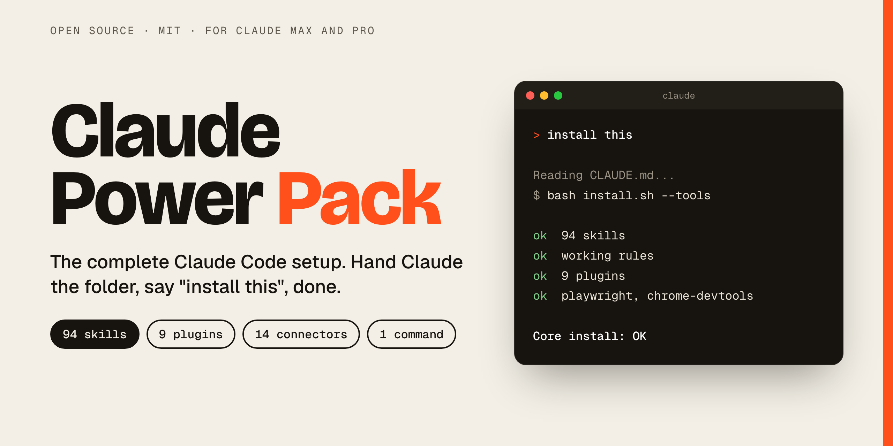
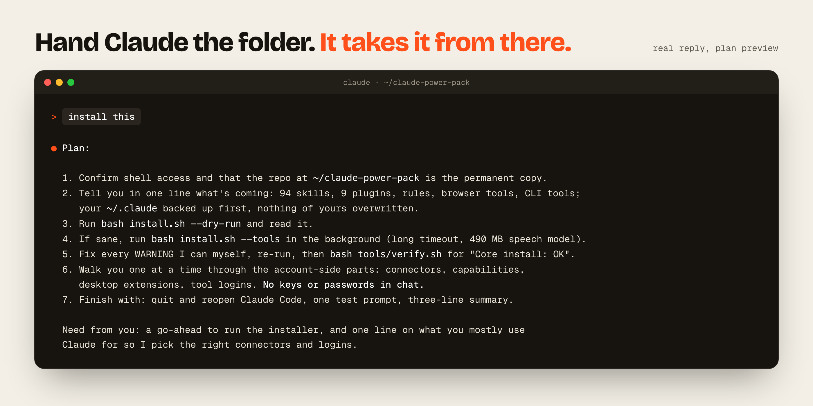
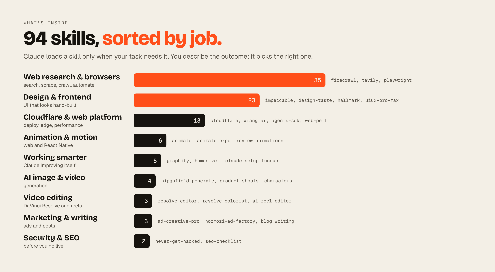
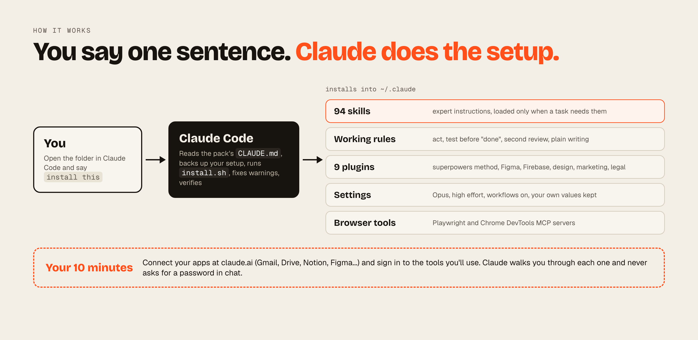
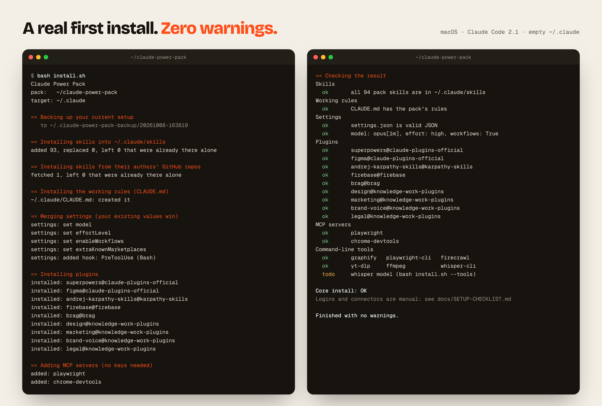

<p align="center">
  <a href="https://mppyxx.github.io/claude-power-pack/"></a>
</p>

<h1 align="center">Claude Power Pack</h1>

<p align="center">
  <b>The complete Claude Code setup in one folder.</b><br>
  94 skills, 9 plugins, working rules and a connector guide.<br>
  Open it in Claude Code, say <code>install this</code>, and you're set.
</p>

<p align="center">
  <a href="https://github.com/mppyxx/claude-power-pack/actions/workflows/ci.yml"></a>
  
  
  
  
  <a href="LICENSE"></a>
</p>

<p align="center">
  <a href="#quick-start">Quick start</a> &middot;
  <a href="#whats-inside">What's inside</a> &middot;
  <a href="#how-it-works">How it works</a> &middot;
  <a href="#is-it-safe">Is it safe?</a> &middot;
  <a href="#faq">FAQ</a> &middot;
  <a href="https://mppyxx.github.io/claude-power-pack/">Website</a>
</p>

---

## What is Claude Power Pack?

**Claude Power Pack is a free, open-source bundle that turns a fresh [Claude Code](https://code.claude.com/docs) install into a fully equipped setup.** It installs 94 agent skills, 9 plugins, a set of working rules for `CLAUDE.md`, recommended settings and two browser MCP servers, then tells you exactly which claude.ai connectors are worth switching on.

It comes from a real setup tuned over months of daily use, with everything personal taken out. Finding good skills one by one takes weeks. This gives you a tested set in about ten minutes, and Claude does the installing.

**Made for:** new Claude Max and Pro subscribers, developers, designers, marketers, founders and video editors who want Claude Code at full strength from day one.

## Quick start

### Option 1: let Claude install it (easiest)

1. Get the folder:
   ```bash
   git clone https://github.com/mppyxx/claude-power-pack ~/claude-power-pack
   ```
   No git? [Download the latest release](https://github.com/mppyxx/claude-power-pack/releases/latest) and unzip it into your home folder.
2. Open the folder in Claude Code, or in the **Code** tab of the Claude desktop app.
3. Type **install this**.

Claude reads the pack's [`CLAUDE.md`](CLAUDE.md), backs up your current setup, runs the installer, fixes any warnings, checks the result, and then walks you through the few logins only you can do.

<p align="center"></p>

### Option 2: one command

```bash
cd ~/claude-power-pack && bash install.sh --tools
```

`--tools` also installs the command-line tools some skills use (ffmpeg, yt-dlp, Whisper, auto-editor, Playwright CLI, Firecrawl CLI, graphify). Run `bash install.sh --dry-run` first if you want to see every change before anything happens.

## What's inside

<p align="center"></p>

| | What you get |
|---|---|
| **94 skills** | Expert instructions Claude loads only when a task needs them. Full list with setup notes in [docs/SKILLS.md](docs/SKILLS.md) |
| **9 plugins** | [superpowers](https://github.com/obra/superpowers) (brainstorm, plan, test, debug, verify), Andrej Karpathy's coding guidelines, Figma, Firebase, brag, and Anthropic's design, marketing, brand-voice and legal plugins |
| **Working rules** | [`rules/CLAUDE.md`](rules/CLAUDE.md): act without hand-holding, test before saying "done", get a second review on big work, write like a person |
| **Settings** | Opus, high effort, workflows on. Values you already set always win |
| **Browser tools** | Playwright and Chrome DevTools MCP servers, ready to use |
| **Connector guide** | 14 claude.ai connectors (Gmail, Calendar, Drive, Notion, Figma, Canva, Vercel and more) and 15 desktop extensions: what each does and where to turn it on. See [docs/CONNECTORS.md](docs/CONNECTORS.md) |

### What you can ask for

| Skills | Highlights | Try asking |
|---|---|---|
| **Web research and browsers** (35) | `firecrawl`, `tavily-research`, `playwright-cli`, `reel-reader` | "Research the top 5 CRMs for a 3-person agency, with sources" |
| **Design and frontend** (23) | `impeccable`, `design-taste-frontend`, `hallmark`, `uiux-pro-max`, `emil-design-eng` | "Build a landing page for my coffee shop that doesn't look AI-generated" |
| **Cloudflare and web platform** (13) | `cloudflare`, `wrangler`, `agents-sdk`, `web-perf` | "Deploy this to Cloudflare Workers and check Core Web Vitals" |
| **Animation and motion** (6) | `animate`, `animate-expo`, `review-animations` | "Make this modal open like an iOS sheet" |
| **Working smarter** (5) | `graphify`, `humanizer`, `claude-setup-tuneup` | "Explain how this codebase fits together" |
| **AI image and video** (4) | `higgsfield-generate`, `higgsfield-product-photoshoot`, `higgsfield-soul-id` | "Make three product shots of this bottle on marble" |
| **Video editing** (3) | `resolve-editor`, `resolve-colorist`, `ai-reel-editor` | "Cut a 30 second reel from this interview, with captions" |
| **Marketing and writing** (3) | `ad-creative-pro`, `hormozi-ad-factory`, `technical-blog-writing` | "Write 20 ad hooks for this offer" |
| **Security and SEO** (2) | `never-get-hacked`, `seo-checklist` | "Is my app safe to launch? Then fix why Google can't find it" |

You never have to name a skill. Describe the outcome and Claude picks the right one, or type `/` and a skill's name to call it directly.

## How it works

<p align="center"></p>

## Before and after

| Fresh Claude Code | With Claude Power Pack |
|---|---|
| Stops to ask before most steps | Picks the best option and builds it. Only stops for money, passwords and messages to people |
| Says "done" once the code is written | Runs it, clicks through the screens, shows you proof |
| UI that looks like every other AI site | 23 design skills, checked in a real browser at desktop and mobile size |
| Limited to the files on your machine | Web research, scraping, browser control, and a guide to 14 app connectors |
| You hunt for skills one at a time | 94 skills that work together, sorted by job |
| Default model and effort | Opus at high effort, with multi-agent workflows on |

## Is it safe?

<p align="center"></p>

- **You can read every line first.** `install.sh` is a plain bash script. `--dry-run` shows each change without making it.
- **It backs up before touching anything,** to `~/.claude-power-pack-backup/<date-time>/`.
- **It never overwrites your stuff.** Skills you already have, settings you already set, and your own edits to the rules are kept unless you pass `--force`.
- **No passwords or API keys.** The installer never asks for one, and the rules tell Claude never to ask for one in chat. Logins happen in your own browser or terminal.
- **No `sudo`.** Nothing outside your user account is changed.
- **Tested on every change.** GitHub Actions runs a full install on macOS and Linux, plus a re-run and a merge test against an existing setup.
- **Every author credited.** Third-party skills keep their own licences ([THIRD_PARTY_NOTICES.md](THIRD_PARTY_NOTICES.md)). Two skills without an open licence aren't copied here; the installer fetches them from their authors.

Skills run with the same permissions as Claude, so the [security policy](SECURITY.md) explains what to check and how to report a problem.

## FAQ

### What is a Claude Code skill?

A skill is a folder with a `SKILL.md` file: instructions, and sometimes scripts, that teach Claude how to do one kind of task well. Claude Code only reads each skill's short description at the start of a session and loads the full instructions when your request matches. So 94 skills cost only their short descriptions until one is actually used.

### Do I need Claude Max?

No, Claude Pro works too. The pack sets Claude Code to Opus at high effort, which uses your limits faster, so Max is the comfortable fit. You can switch models any time with `/model`.

### Will it overwrite my current Claude setup?

No. It backs everything up first, adds only what's missing, and keeps your own skills, settings and rules. Running it again is safe and changes nothing you've edited.

### Does it work on Windows?

The installer is a bash script, tested on macOS and Linux. On Windows, WSL may work, but it isn't tested yet. The desktop extensions in the connector guide are Mac apps.

### Does it cost anything?

The pack is free and MIT licensed, and most tools it uses have free tiers. A few need paid accounts: Higgsfield credits for AI image and video, an Ahrefs plan for SEO data, and DaVinci Resolve Studio for the two Resolve skills.

### Can Claude install it for me?

Yes, that's the easiest way. Open the folder in Claude Code and say "install this". The pack's [`CLAUDE.md`](CLAUDE.md) tells Claude every step, including what to hand back to you.

### How do I update it?

```bash
cd ~/claude-power-pack && git pull && bash install.sh
```

A re-run keeps everything you changed. To replace your skills with the pack's newest copies, add `--force` (the old versions go to the backup folder, and the pack's rules section is reset too).

### How do I uninstall it?

Your previous setup is in `~/.claude-power-pack-backup/`. Remove the skills you don't want from `~/.claude/skills`, delete the section between the `claude-power-pack` markers in `~/.claude/CLAUDE.md`, and use `claude plugin uninstall <name>` and `claude mcp remove <name>`. [docs/SETUP-CHECKLIST.md](docs/SETUP-CHECKLIST.md) has the details.

### How is this different from an awesome list?

An awesome list gives you hundreds of links to evaluate. This is a smaller set that has been used together daily, installed in one step, with working rules that change how Claude behaves and an installer that Claude itself can run.

### Is this made by Anthropic?

No. It's an independent community project. Claude is a trademark of Anthropic.

## Docs

| | |
|---|---|
| [docs/SKILLS.md](docs/SKILLS.md) | Every skill: what it does and what it needs |
| [docs/CONNECTORS.md](docs/CONNECTORS.md) | Connectors, desktop extensions and MCP servers, and where to turn each on |
| [docs/HOW-CLAUDE-WORKS.md](docs/HOW-CLAUDE-WORKS.md) | How the pieces fit together, what to ask for, habits that get better results |
| [docs/SETUP-CHECKLIST.md](docs/SETUP-CHECKLIST.md) | The manual steps, with test prompts and how to undo everything |
| [Overview PDF](docs/Claude-Power-Pack-overview.pdf) | A 3-page visual summary to share |

## Contributing

Know a skill that belongs here? [Suggest it](https://github.com/mppyxx/claude-power-pack/issues/new/choose). It needs an open licence, and [CONTRIBUTING.md](CONTRIBUTING.md) explains how to test a change.

## Credits and licence

Most skills here were written by other people and are shared under their open-source licences: see [THIRD_PARTY_NOTICES.md](THIRD_PARTY_NOTICES.md) for every author and licence. Everything written for this pack is [MIT](LICENSE).

Not affiliated with Anthropic.

<p align="center"><b>If this saved you a weekend of setup, a star helps other people find it.</b></p>
